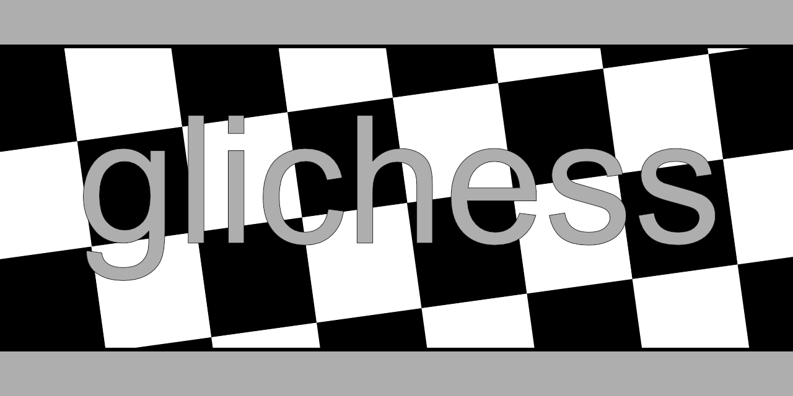

# Want to build a connected chess board?

Us too. Introducing: glichess!

Here's the plan:

1. [Material List](#materials)
2. [Wiring Guide](#wiring)
3. [Intro to the Code](#code)
4. [Playing](#playing)
5. [If Something Goes Wrong](#help)

## Material List

|Quantity|Part|Use|Note|
|--------|----|---|----|
|x1|[8" x 8" Chess Set](https://www.spinmaster.com/en-US/brands/spin-master-games/clear-chess-and-checkers-set-with-glass-gameboard-for-adults-and-kids-ages-8-and-up)|Base chess board with accompanying pieces|This is slightly smaller than a standard chess board! Be aware if you aren't using the same product|
|x32|[5/16" x 1/16" Neodymium Disc Magnets N52](https://totalelement.com/collections/disc-magnets/products/5-16-x-1-16-inch-neodymium-rare-earth-disc-magnets-n52-100-pack)|Make chess pieces detectable||
|x64|[AH3582-P-A Hall Effect Sensor](https://www.digikey.com/en/products/detail/diodes-incorporated/AH3582-P-A/9649758)|Detect magnets||
|x64|[1N4148 Diode Standard 75 V 300mA (DC) Through Hole DO-35](https://www.digikey.com/en/products/detail/smc-diode-solutions/1N4148/6022448)|Control flow||

## Wiring Guide

To do

## Intro to the Code

To do

## Playing

To do

## If Something Goes Wrong

To do
